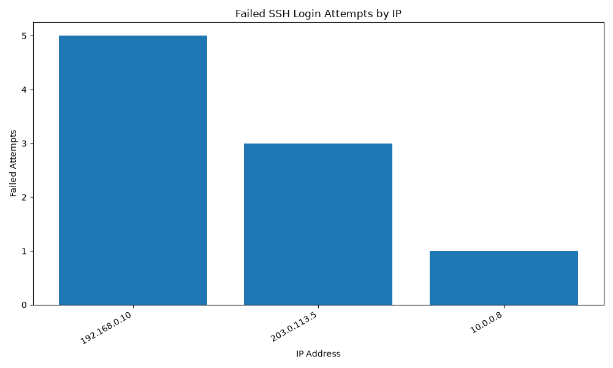

# SSH Brute Force Log Detector

## One-line Summary

A Python-based security log analysis tool that detects suspicious SSH brute-force login attempts from Linux authentication logs and generates CSV, Markdown, and graph-based security reports.

## Problem Statement

SSH servers often receive repeated failed login attempts from unknown IP addresses. Manually reviewing Linux authentication logs can be time-consuming and error-prone.

This project automates the process of identifying suspicious SSH brute-force patterns from authentication logs.

## Key Features

- Parses Linux SSH authentication logs
- Extracts failed login events
- Extracts timestamps, IP addresses, and usernames
- Applies a Sliding Window detection rule
- Flags suspicious IP addresses
- Generates a CSV report
- Generates a Markdown security report
- Generates a graph-based report

## Detection Rule

3 or more failed SSH login attempts within 5 minutes.

If the same IP address exceeds this threshold within the time window, it is flagged as High Risk.

## Project Structure

ssh-bruteforce-log-detector/
├── detector.py
├── README.md
├── requirements.txt
├── .gitignore
├── sample_logs/
│   └── sample_auth.log
└── outputs/
    ├── suspicious_ips.csv
    ├── security_report.md
    └── failed_attempts_by_ip.png

## Tech Stack

- Python
- Regex
- CSV
- Markdown
- Matplotlib
- Linux SSH authentication logs
- Sliding Window detection

## How It Works

Linux SSH auth.log
→ Read log file
→ Filter "Failed password" events
→ Extract timestamp, IP address, and username
→ Group failed login events by IP address
→ Apply Sliding Window detection rule
→ Flag suspicious IP addresses
→ Generate CSV, Markdown, and graph-based reports

## Usage

Install dependencies:

pip install -r requirements.txt

Run the detector:

python detector.py

## Output Files

### CSV Report

outputs/suspicious_ips.csv

### Markdown Security Report

outputs/security_report.md

### Graph Report

outputs/failed_attempts_by_ip.png

## Security Interpretation

Repeated failed SSH login attempts from the same IP address within a short time window may indicate brute-force activity or automated password guessing.

This tool does not block IP addresses automatically. It only analyzes logs and generates reports for defensive security learning.

## Limitations

- This tool analyzes stored log files, not real-time traffic.
- The current detection logic is threshold-based.
- Slow brute-force attacks may avoid detection.
- Distributed attacks from many IP addresses may not be detected.
- Different Linux distributions may use different SSH log formats.
- This is not a full SIEM system.

## Ethical Use

This project is intended for defensive cybersecurity education and authorized log analysis only.

Do not use this project for unauthorized access attempts, attacking real systems, scanning systems without permission, credential guessing, or malicious activity.

## Future Improvements

- Add command-line arguments
- Add configurable threshold and time window
- Add password spraying detection
- Add MITRE ATT&CK mapping
- Add test cases with pytest
- Add Streamlit dashboard
- Support real Linux auth.log files
- Extend to AWS EC2 SSH log analysis

## Resume Bullet

Developed a Python-based SSH brute-force log detector that parses Linux authentication logs, applies a sliding-window detection rule, and generates CSV, Markdown, and graph-based security reports.

## Status

Current status: MVP completed.

Implemented:

- Log parsing
- Failed login extraction
- Timestamp, IP, and username extraction
- Sliding Window detection
- CSV report generation
- Markdown report generation
- Graph generation

## Graph Output

